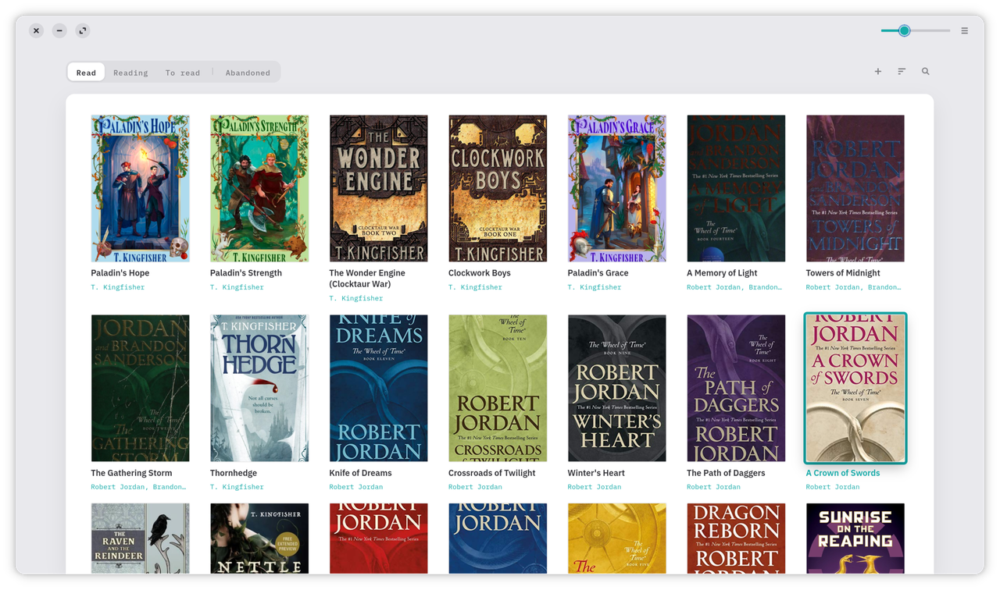
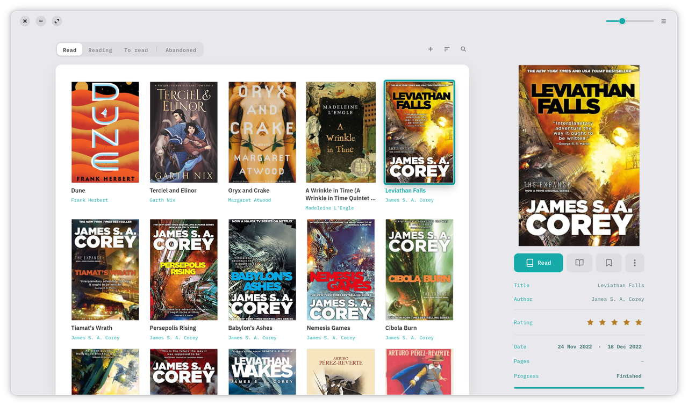
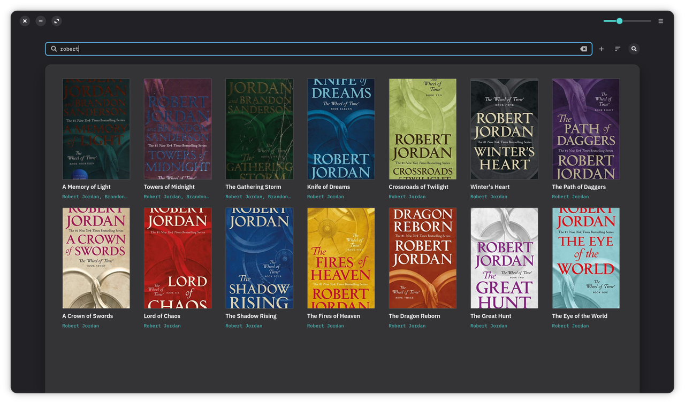

<p align="center">
  
</p>

<h1 align="center">Quill</h1>

<p align="center">
  A calm, offline-first reading tracker for GNOME —<br>
  no accounts, no cloud, no noise. Just the books you're reading, close at hand.
</p>

<p align="center">
  
</p>

Quill keeps shelves for the books you want to read, are reading, and have
finished. Rate them, jot a note, track where you are — and add new titles in
seconds by searching Open Library or Google Books. Everything lives in a local
library on your own machine.

<p align="center">
  
  
</p>

## Features

**Your shelves**
- **Read · Reading · To read · Abandoned** shelves as segmented tabs
- A **master–detail** layout: a paper card of covers with an info panel for the
  selected book — cover, status, rating, dates, progress, tags and summary
- A **three-way status control** that moves a book between shelves in place

**Track your reading**
- **Start and finish dates captured automatically**, and editable in a
  Monday-first calendar that **highlights the whole started→finished span**
- **Reading progress** by page, with a slim progress bar
- **Star ratings**, **per-book tags**, and an autosaving **summary**

**Fill your library fast**
- **Add books** by searching **Open Library or Google Books** (switchable), or
  **add manually** — cover art and summaries are fetched automatically
- **Import** an existing library from an **Openreads CSV export**, and **export**
  back to a round-trippable CSV
- A **cover-size slider**, and search by title, author or tag

## Install

Grab the latest `.flatpak` bundle from the
[**Releases**](https://github.com/DrVonMiau/quill/releases) page, then install
and run it:

```sh
flatpak install --user io.github.drvonmiau.Quill.flatpak
flatpak run io.github.drvonmiau.Quill
```

The first command may offer to pull in the GNOME runtime the app needs — say
yes. You only need [Flatpak](https://flatpak.org/setup/) installed, which most
Linux distributions already have.

## Building from source

Open the project in **GNOME Builder** and press Run — the included Flatpak
manifest (`io.github.drvonmiau.Quill.json`) takes care of everything.

Or with `flatpak-builder` directly:

```sh
flatpak-builder --user --install --force-clean _flatpak io.github.drvonmiau.Quill.json
flatpak run io.github.drvonmiau.Quill
```

## Part of a family

Quill is one of three sibling apps that share a design language — the same calm,
offline-first idea recast for different libraries:

- 📖 **Quill** — your reading *(you are here)*
- 🎵 [**Lyre**](https://github.com/DrVonMiau/lyre) — your music
- 🖼️ [**Easel**](https://github.com/DrVonMiau/easel) — your photos

## Built with

GTK4 · libadwaita · PyGObject, packaged as a Flatpak on the GNOME runtime.

## License

Quill is free software, released under the
[GNU GPL 3.0 or later](COPYING).
